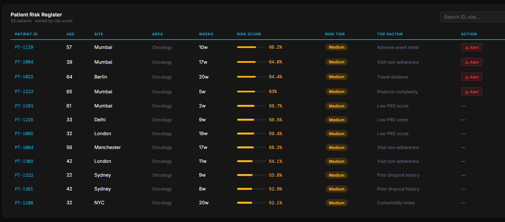
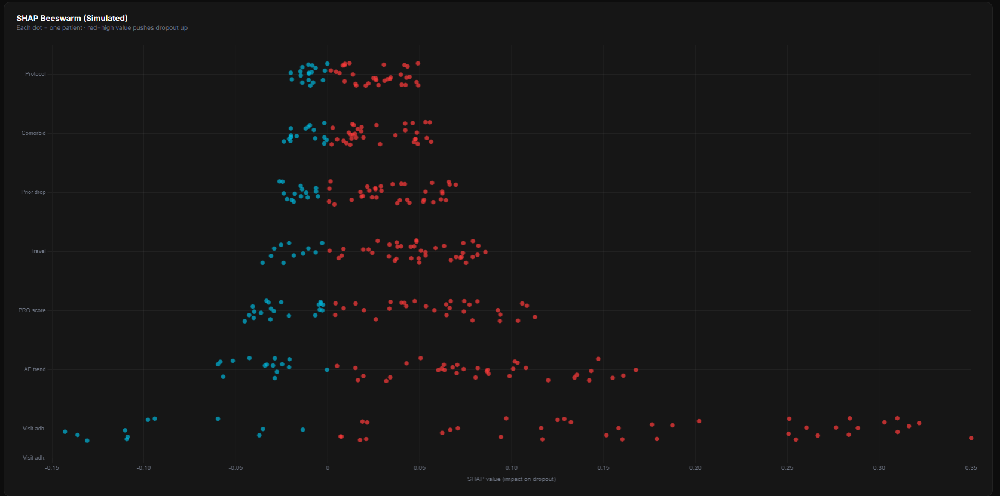
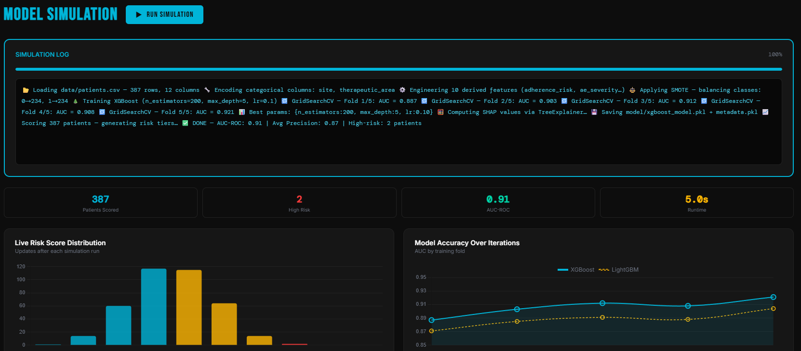

<div align="center">

<!-- Animated Banner -->


<!-- Badges Row 1 -->
<p>
  
  
  
  
</p>

<!-- Badges Row 2 -->
<p>
  
  
  
  
  
</p>

<br/>

<!-- Animated typing SVG -->
<a href="https://git.io/typing-svg"></a>

</div>

---

## 🧬 What is PharmaTrialGuard?

> **PharmaTrialGuard** is an end-to-end machine learning system that predicts patient dropout risk in clinical trials — before it costs the study millions of dollars and months of delay.

Clinical trial failures cost the pharmaceutical industry **$600B+ annually**, with patient dropout being a leading cause. TrialGuard uses a trained **XGBoost classifier** combined with **SHAP explainability** to not just flag at-risk patients, but *explain why* — giving trial managers actionable, transparent insight through a real-time interactive dashboard.

---

## 🎯 Problem → Solution

```
❌ BEFORE TrialGuard                         ✅ AFTER TrialGuard
─────────────────────────────────────        ──────────────────────────────────────
Dropout detected AFTER it happens      →     Risk scored BEFORE dropout occurs
No insight into WHY patients drop out  →     SHAP explains every prediction
Manual, reactive monitoring            →     Automated, proactive risk pipeline
Black-box model decisions              →     Full per-patient explainability
Static spreadsheets                    →     Live interactive clinical dashboard
```

---

## 📸 Dashboard Preview

<div align="center">

> ⚡ **Interactive dashboard running at `dashboard/index.html`**
<div align="center">
  
  <br/><br/>
  
  
  <br/><br/>
  
</div>

*Patient risk table · SHAP beeswarm · Feature importance · Live scoring engine*

</div>

---

## 🏗️ Architecture

```
pharma-trialguard/
│
├── 📊 clinical_data.csv          ← 400 synthetic patients (age, distance, adherence, AEs)
│
├── 🐍 generate_data.py           ← Synthetic data generator with realistic dropout logic
│
├── model/
│   ├── 🧠 train_model.py         ← XGBoost classifier training + model serialisation
│   ├── 🔮 predict.py             ← Batch dropout probability scoring
│   ├── 🔍 shap_export.py         ← SHAP TreeExplainer → beeswarm + bar charts
│   └── 📦 xgboost_model.pkl      ← Serialised trained model
│
├── data/
│   ├── feature_importance.csv    ← Top feature weights
│   ├── predictions.csv           ← Scored patient output
│   └── shap_values.csv           ← Per-patient SHAP decomposition
│
└── dashboard/
    ├── 🖥️  index.html             ← Full interactive clinical dashboard (Chart.js)
    ├── shap_beeswarm.png         ← SHAP summary beeswarm plot
    └── shap_importance.png       ← Global feature importance bar chart
```

---

## ⚙️ Tech Stack

<div align="center">

| Layer | Technology | Purpose |
|-------|-----------|---------|
| 🤖 **ML Model** | XGBoost | Gradient-boosted dropout classifier |
| 🔍 **Explainability** | SHAP TreeExplainer | Per-patient prediction decomposition |
| 📐 **Feature Engineering** | scikit-learn | Train/test split, preprocessing |
| 📊 **Data** | pandas + NumPy | Synthetic patient data generation |
| 🖥️ **Dashboard** | Chart.js + PapaParse | Real-time interactive risk visualisation |
| 💾 **Serialisation** | joblib + pickle | Model persistence |
| 🎨 **UI Design** | Vanilla HTML/CSS/JS | Zero-dependency, deployable anywhere |

</div>

---

## 🔬 Features in Detail

### 🧠 Machine Learning Pipeline

- **XGBoost Classifier** trained on 5 clinical features: `age`, `distance_to_site`, `adverse_events`, `visit_adherence`, `comorbidity_score`
- **Dropout logic**: patients flagged if `adverse_events > 2` OR `visit_adherence < 0.7` OR `distance_to_site > 70`
- 80/20 train-test split with `predict_proba` for continuous risk scoring (0–100%)
- Model serialised and reloadable for production inference

### 🔍 SHAP Explainability

- **SHAP TreeExplainer** generates per-patient feature contribution scores
- **Beeswarm plot** → shows feature impact distribution across all patients
- **Bar chart** → global feature importance ranking
- Every prediction is *decomposable*: know exactly which feature drove each patient's risk score

### 🖥️ Interactive Dashboard

- **Patient risk table** with colour-coded risk tiers (High 🔴 / Medium 🟡 / Low 🟢)
- **Live XGBoost inference** — run the model directly in the browser
- **SHAP visualisations** embedded and zoomable
- **Sidebar filters** by risk threshold and patient segment
- Fully dark-mode, responsive clinical UI built with `Bebas Neue` + `DM Mono` typography

---

## 🚀 Quickstart

```bash
# 1. Clone the repo
git clone https://github.com/your-username/pharma-trialguard.git
cd pharma-trialguard

# 2. Install dependencies
pip install -r requirements.txt

# 3. Generate synthetic patient data
python generate_data.py

# 4. Train the XGBoost model
python model/train_model.py

# 5. Score all patients
python model/predict.py

# 6. Export SHAP explainability plots
python model/shap_export.py

# 7. Open the dashboard
open dashboard/index.html
```

---

## 📦 Requirements

```txt
pandas
xgboost
scikit-learn
joblib
shap
matplotlib
```

Install all with:
```bash
pip install -r requirements.txt
```

---

## 📊 Model Features

| Feature | Type | Clinical Meaning |
|---------|------|-----------------|
| `age` | Integer (18–80) | Patient age — older patients may have higher dropout |
| `distance_to_site` | Integer (1–100 km) | Travel burden → key dropout driver |
| `adverse_events` | Integer (0–4) | Reported adverse events count |
| `visit_adherence` | Float (0.5–1.0) | Ratio of attended vs scheduled visits |
| `comorbidity_score` | Integer (0–4) | Count of comorbid conditions |

**Target variable:** `dropout` (binary: 1 = dropped out, 0 = completed)

---

## 🧩 How Dropout is Defined

```python
data["dropout"] = (
    (data["adverse_events"] > 2)      |   # Too many adverse events
    (data["visit_adherence"] < 0.7)   |   # Poor visit adherence
    (data["distance_to_site"] > 70)       # Too far from trial site
).astype(int)
```

This multi-factor rule captures the three most clinically validated predictors of trial dropout.

---

## 🌐 Real-World Impact

```
💊  Clinical Trial Phase II/III average cost:  $20M–$100M
📉  ~30% of trials fail due to patient dropout
⏱️  Each dropout causes 3–6 months delay on average
🎯  TrialGuard identifies high-risk patients early → enables proactive retention
✅  Explainable AI → compliant with ICH E6 GCP transparency requirements
```

---

## 🛣️ Roadmap

- [ ] 🏥 Real EHR integration (FHIR / HL7 API connector)
- [ ] 📡 REST API wrapper for trial management systems (Medidata / Veeva)
- [ ] 🔄 Longitudinal risk tracking (patient risk over trial timeline)
- [ ] 📱 Mobile alert system for site coordinators
- [ ] 🧬 Extend features: genetic markers, PRO scores, wearable signals
- [ ] 🐳 Docker + cloud deployment (AWS/GCP ready)
- [ ] 🔒 HIPAA-compliant data handling layer

---

## 🤝 Contributing

Pull requests are welcome! For major changes, open an issue first to discuss what you'd like to change.

```bash
git checkout -b feature/your-feature-name
git commit -m "feat: add your feature"
git push origin feature/your-feature-name
```

---

## 📄 License

This project is licensed under the **MIT License** — see [LICENSE](LICENSE) for details.

---

<div align="center">

<!-- Footer wave -->


<p>
  <sub>Built with ❤️ for the future of clinical AI · <strong>PharmaTrialGuard</strong> · Keeping patients in trials, research on track</sub>
</p>

<p>
  
  
  
</p>

</div>
